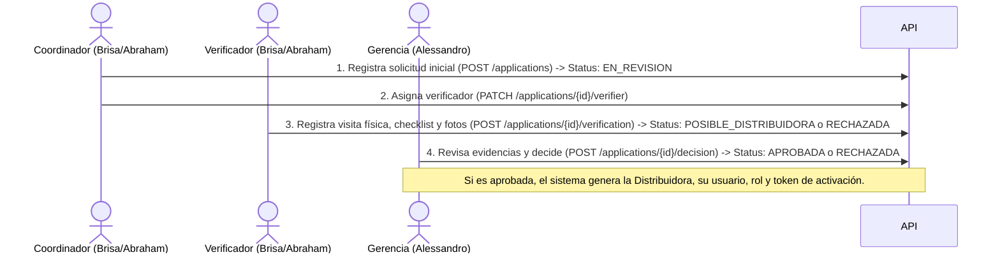
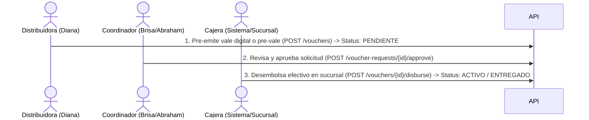
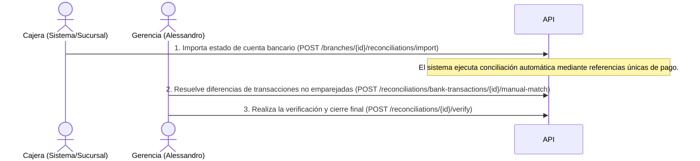

# 📋 Plan de Trabajo y Asignación de Roles — Sistema "Mis Vales"

Este documento contiene la distribución de responsabilidades y las tareas específicas de desarrollo a realizar para cada uno de los roles principales del sistema, alineando el backend de **Laravel 13** con el frontend en **Nuxt 4**.

---

## 👥 Resumen de Asignación de Roles

| Integrante | Rol en el Sistema | Acceso en Frontend | Responsabilidad Principal |
| :--- | :--- | :--- | :--- |
| **Alessandro** | Gerente General / Gerencia | `/general` | Administración global, aprobación final de distribuidoras, incremento de crédito, canjes de puntos, conciliaciones manuales y configuraciones del sistema. |
| **Brisa y Abraham** | Coordinador & Verificador | `/registro-verificacion` | Captura inicial de solicitudes de distribuidoras, asignación de visitas de verificación, ejecución de visitas físicas en campo, registro de evidencias y pre-autorización de créditos. |
| **Diana** | Distribuidora | `/distributor-portal` | Registro de clientes finales, solicitud de traspasos, emisión de vales (digitales/pre-vales), consulta de estados de cuenta y canje de puntos. |

---

## 🔄 Flujos y Procesos Clave del Sistema

A continuación se detalla cómo interactúan los integrantes a lo largo del ciclo de vida operativo del sistema:

### 1. Proceso de Alta de Distribuidora

### 2. Proceso de Emisión y Desembolso de Vales

### 3. Proceso de Conciliación Bancaria y Pagos

---

## 🛠️ Tareas Específicas por Desarrollador / Rol

### 1. Alessandro — Gerencia (`/general`)
**Alessandro** es responsable del panel de control central de la empresa. Debe migrar la interfaz actual (que usa datos simulados en Nuxt) y conectarla con los servicios reales del backend de Laravel.

#### 🖥️ Tareas en Frontend (Nuxt 4)
- [ ] **Bandeja de Aprobaciones (`/general/inbox`)**:
  - Reemplazar la bandeja de correos ficticia por un panel de solicitudes pendientes de decisión.
  - Diseñar sub-pestañas o filtros para:
    1. **Solicitudes de Distribuidora** (`POSIBLE_DISTRIBUIDORA`). Debe permitir ver fotos de la fachada, el reporte de buró de crédito, el checklist de verificación y botones para **Aprobar** (asignar límite de crédito inicial y categoría) o **Rechazar**.
    2. **Incrementos de Crédito** (`PRE_AUTORIZADO`). Botones para aprobar, reducir el monto sugerido o rechazar.
    3. **Canjes de Puntos** (`PENDIENTE`). Mostrar los puntos solicitados por la distribuidora y el equivalente monetario o producto para su aprobación o rechazo.
- [ ] **Dashboard e Indicadores Principales (`/general/index.vue`)**:
  - Conectar los widgets con estadísticas reales del backend (Línea de crédito colocada, morosidad promedio, cobros del día, vales activos).
  - Graficar el comportamiento mensual de colocación y cobranza.
- [ ] **Módulo de Sucursales (`/general/branches.vue`)**:
  - Conectar la tabla con `GET /branches` y habilitar el modal de creación y edición llamando a `POST /branches` y `PATCH /branches/{id}`.
  - Implementar la edición de configuraciones de sucursal (`/general/settings` conectando a `PATCH /branches/{id}/settings`).
- [ ] **Módulo de Conciliaciones**:
  - Crear una pantalla para visualizar transacciones bancarias importadas (`GET /reconciliations/bank-transactions`).
  - Crear interfaz interactiva de match manual para asociar depósitos con referencias incorrectas a sus respectivas relaciones de cobro (`POST /reconciliations/bank-transactions/{id}/manual-match`).
  - Permitir firmar/verificar conciliaciones completadas (`POST /reconciliations/{reconciliation}/verify`).

#### 🔌 Endpoints del Backend a Utilizar
- **Aprobaciones de Distribuidora**: [ApplicationDecisionController.php](file:///c:/Users/jorge/Desktop/8to%20custrimestre/Desarrollo-Software/vouchers-platform-api/app/Http/Controllers/GeneralManager/ApplicationDecisionController.php) -> `POST /api/v1/applications/{application}/decision`
- **Gestión de Sucursales**: [BranchController.php](file:///c:/Users/jorge/Desktop/8to%20custrimestre/Desarrollo-Software/vouchers-platform-api/app/Http/Controllers/GeneralManager/BranchController.php) -> `GET /api/v1/branches`, `POST /api/v1/branches`, `PATCH /api/v1/branches/{branch}`
- **Decisión de Incrementos de Crédito**: [GeneralManagerCreditIncreaseController.php](file:///c:/Users/jorge/Desktop/8to%20custrimestre/Desarrollo-Software/vouchers-platform-api/app/Http/Controllers/GeneralManager/CreditIncreaseController.php) -> `GET /api/v1/credit-increase-requests`, `POST /api/v1/credit-increase-requests/{creditIncreaseRequest}/decision`
- **Conciliación Manual**: [GeneralManagerReconciliationController.php](file:///c:/Users/jorge/Desktop/8to%20custrimestre/Desarrollo-Software/vouchers-platform-api/app/Http/Controllers/GeneralManager/ReconciliationController.php) -> `POST /api/v1/reconciliations/bank-transactions/{bankTransaction}/manual-match`, `POST /api/v1/reconciliations/{reconciliation}/verify`
- **Canje de Puntos**: [GeneralManagerPointController.php](file:///c:/Users/jorge/Desktop/8to%20custrimestre/Desarrollo-Software/vouchers-platform-api/app/Http/Controllers/GeneralManager/PointController.php) -> `GET /api/v1/point-redemptions`, `POST /api/v1/point-redemptions/{pointRedemption}/decision`

---

### 2. Brisa y Abraham — Coordinación & Verificación (`/registro-verificacion`)
**Brisa** y **Abraham** manejarán de forma conjunta el ciclo previo de alta de las distribuidoras. El portal `/registro-verificacion` debe adaptarse dinámicamente según el rol con el que se inicie sesión (`coordinator` o `verifier`).

#### 🖥️ Tareas en Frontend (Nuxt 4)
- [ ] **Home del Portal (`/registro-verificacion/index.vue`)**:
  - Mostrar métricas filtradas según el rol del usuario autenticado.
  - Si es **Coordinador**: solicitudes creadas por él, pendientes de asignación de verificador y aprobadas.
  - Si es **Verificador**: solicitudes asignadas pendientes de visita física.
- [ ] **Formulario de Registro de Solicitud (`/registro-verificacion/new.vue`) [NUEVO]**:
  - Implementar captura de datos personales del solicitante (Person data).
  - Capturar campos específicos de la solicitud: límite solicitado, referencias familiares, datos de vivienda, afiliación externa.
  - Permitir adjuntar documentos escaneados (Fachada, INE frontal/reverso, Comprobante de domicilio, Reporte de buró) que se subirán a la API.
- [ ] **Pantalla de Verificación en Campo (Para Móviles/Tablets)**:
  - Formulario de visita física para el rol de **Verificador**.
  - Debe capturar:
    - Geolocalización actual (Latitud y Longitud obtenidas vía GPS del navegador).
    - Subida de fotografías en tiempo real (Foto de fachada, foto del solicitante sosteniendo su INE, foto del comprobante de domicilio físico).
    - Checklist de validación (Vivienda propia, arraigo en la zona, etc.).
    - Notas y dictamen del verificador (Aprobado/Rechazado).
- [ ] **Bandeja de Coordinación (Para Coordinadores)**:
  - Lista de solicitudes activas.
  - Modal para asignar un Verificador disponible de la lista (`PATCH /applications/{id}/verifier`).
  - Panel para pre-autorizar incrementos de crédito solicitados por distribuidoras (`POST /credit-increase-requests/{id}/pre-authorize`).
  - Pantalla para revisar y aprobar la emisión de Vales Digitales (`POST /voucher-requests/{voucherRequest}/approve`).

#### 🔌 Endpoints del Backend a Utilizar
- **Gestión del Coordinador**: [CoordinadorController.php](file:///c:/Users/jorge/Desktop/8to%20custrimestre/Desarrollo-Software/vouchers-platform-api/app/Http/Controllers/Coordinator/CoordinadorController.php) -> `GET /api/v1/applications`, `POST /api/v1/applications`, `PATCH /api/v1/applications/{application}/verifier`
- **Acciones del Verificador**: [VerificadorController.php](file:///c:/Users/jorge/Desktop/8to%20custrimestre/Desarrollo-Software/vouchers-platform-api/app/Http/Controllers/Checker/VerificadorController.php) -> `POST /api/v1/applications/{application}/verification`
- **Aprobación de Vales**: [CoordinatorVoucherController.php](file:///c:/Users/jorge/Desktop/8to%20custrimestre/Desarrollo-Software/vouchers-platform-api/app/Http/Controllers/Coordinator/VoucherController.php) -> `POST /api/v1/voucher-requests/{voucherRequest}/approve`
- **Pre-autorizar Aumento de Límite**: [CoordinatorCreditIncreaseController.php](file:///c:/Users/jorge/Desktop/8to%20custrimestre/Desarrollo-Software/vouchers-platform-api/app/Http/Controllers/Coordinator/CreditIncreaseController.php) -> `POST /api/v1/credit-increase-requests`, `POST /api/v1/credit-increase-requests/{creditIncreaseRequest}/pre-authorize`

---

### 3. Diana — Portal de Distribuidora (`/distributor-portal`)
**Diana** representará el flujo final y el core de negocio: la distribuidora. Su portal está enfocado en operar la línea de crédito y dar seguimiento a sus clientes.

#### 🖥️ Tareas en Frontend (Nuxt 4)
- [ ] **Dashboard de la Distribuidora (`/distributor-portal/index.vue`)**:
  - Mostrar de forma destacada: Crédito límite, Crédito disponible, Saldo al corte actual, Fecha límite de pago y Referencia única para depósito bancario.
  - Historial rápido de vales emitidos recientemente.
- [ ] **Módulo de Clientes Finanaciados (Clientes)**:
  - Formulario para registrar nuevos clientes finales (`POST /api/v1/customers`), capturando su CURP, teléfono y datos personales.
  - Tabla de clientes activos con su estatus de crédito.
  - Solicitud de Traspaso de cliente: Formulario para solicitar traer a un cliente de otra distribuidora bajo autorización (`POST /api/v1/customers/{id}/transfer-requests`).
- [ ] **Generador de Vales Digitales / Pre-vales**:
  - Formulario para emitir un vale. Debe permitir seleccionar el cliente, el monto a prestar, el número de quincenas (plazo) y el producto financiero.
  - Al enviar, si el sistema requiere autorización del coordinador, se creará un `VoucherRequest`. De lo contrario, se pre-emite el vale para ser cobrado en caja.
- [ ] **Estado de Cuenta y Relaciones de Corte**:
  - Pantalla para consultar los cortes generados (`Cutoffs`).
  - Desglose detallado del saldo: Deuda capital, comisión cobrada, seguro, puntos acumulados y recargos aplicados si está en mora.
- [ ] **Canje de Puntos de Lealtad**:
  - Visualización del saldo de puntos.
  - Formulario para solicitar canjear puntos acumulados por dinero o abonos al saldo (`POST /api/v1/distributors/{id}/points/redeem`).

#### 🔌 Endpoints del Backend a Utilizar
- **Registro de Clientes**: [DistributorCustomerController.php](file:///c:/Users/jorge/Desktop/8to%20custrimestre/Desarrollo-Software/vouchers-platform-api/app/Http/Controllers/Distributor/CustomerController.php) -> `POST /api/v1/customers`
- **Traspaso de Clientes**: [DistributorCustomerTransferController.php](file:///c:/Users/jorge/Desktop/8to%20custrimestre/Desarrollo-Software/vouchers-platform-api/app/Http/Controllers/Distributor/CustomerTransferController.php) -> `GET /api/v1/distributor/customer-transfer-requests`, `POST /api/v1/customers/{customer}/transfer-requests`, `POST /api/v1/customer-transfer-requests/{customerTransferRequest}/cancel`
- **Emisión de Vales**: [DistributorVoucherController.php](file:///c:/Users/jorge/Desktop/8to%20custrimestre/Desarrollo-Software/vouchers-platform-api/app/Http/Controllers/Distributor/VoucherController.php) -> `GET /api/v1/distributor/vouchers`, `POST /api/v1/vouchers`
- **Canje de Puntos**: [DistributorPointController.php](file:///c:/Users/jorge/Desktop/8to%20custrimestre/Desarrollo-Software/vouchers-platform-api/app/Http/Controllers/Distributor/PointController.php) -> `POST /api/v1/distributors/{distributor}/points/redeem`, `GET /api/v1/distributors/{distributor}/points/redemptions`

---

## 🔐 Integración Base (Tarea Compartida Inicial)
Antes de que cada desarrollador comience sus pantallas, se debe asegurar que la comunicación con el Backend de Laravel sea correcta.

- [ ] **Autenticación e Interceptores**:
  - El composable `useAuth.ts` ya está listo para leer cookies de sesión.
  - Asegurar que todas las llamadas HTTP en Nuxt incluyan el encabezado `Authorization: Bearer <auth_token>` de forma automática.
  - Configurar las variables del `.env` en Nuxt para apuntar a la URL de la API de Laravel (por defecto `http://localhost:8000/api/v1`).
- [ ] **Control de Roles en Rutas**:
  - Asegurar que el middleware global de Nuxt bloquee las secciones si el usuario no tiene el rol asignado.
  - Si un usuario con rol `verifier` intenta entrar a `/general`, redirigir inmediatamente a `/registro-verificacion`.
